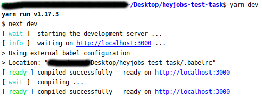
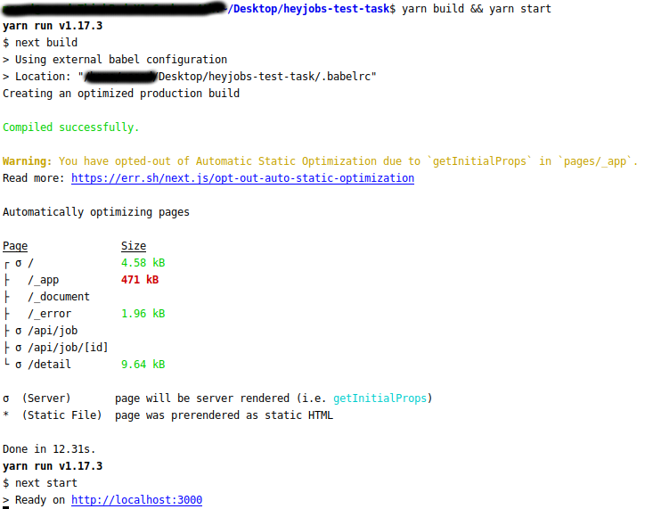
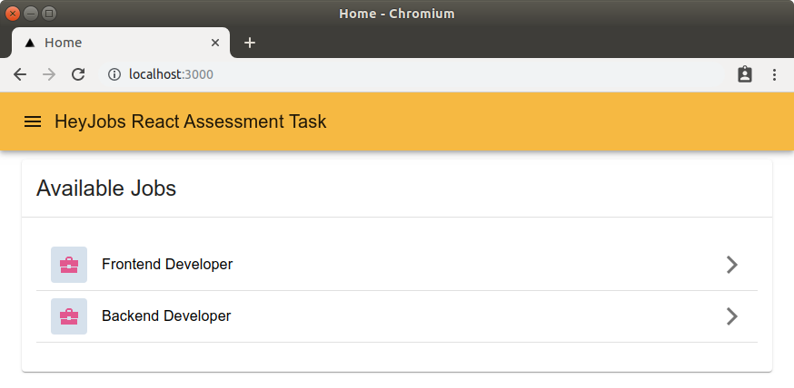
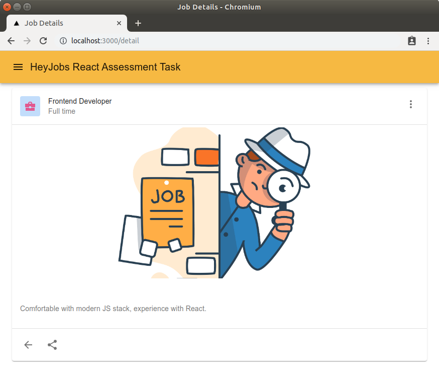

# HeyJobs React Assessment Task

Thank you for assigning this simple test task! 

## Requirements

* Build a React application which:
   * Displays a list of available jobs.
   * Clicking on a job in the list will bring the user to a page which displays all details of the job.
* The app should be server-rendered.
* The app should be responsive.
* You should create and use dummy data for the list of jobs. We suggest the following format:
```
[
  {
    "id": 1,
    "title": "Frontend Developer",
    "description": "Comfortable with modern JS stack, experience with React.",
    "employment_type": "full_time"
  }
]
```

## Assumptions

Following are some assumptions made for implementing this solution:
* Only job title is required to display list of available jobs.
* Details of the job need to be retrieved from redux store, in order to demo redux skills.
* Dummy data is hard-coded in `jobData.js` file. The job listing API reads this file and sends it in **json** format for client consumption.

## Tech Stack

* Following tech stack is used:
  * [Redux](https://github.com/reactjs/redux)
  * [Styled Components](https://github.com/styled-components/styled-components)
  * [Material UI](https://material-ui.com/https://material-ui.com/)
  * [Jest](https://github.com/facebook/jest)
  * [NextJS](https://nextjs.org/) - SSR React framework
  * [Yarn](https://yarnpkg.com/lang/en/)

NextJS helps to render the app on server-side with zero setup. Webpack, code splitting, filesystem based routing, hot code reloading and universal rendering are all pre-configured with NextJS.

## Code Execution

Execute following commands:
```
yarn install
yarn dev
```
Then go to `http://localhost:3000` to view the app.


For production build execute following command:
```
yarn build && yarn start
```


## User Interface

* Integrated mobile-first Material UI React components with Styled Components. This helped to quickly build a responsive app with a standard UI. The theme instance for Material UI is exported from `config/materialTheme.js` file.
* Styled components uses `styled` function to over-ride Material UI components.
 
 

## API

NextJS provides out of the box solution to develop API routes. Every file inside `./pages/api` is mapped to `/api/*`. For example, `./pages/api/job/index.js` is mapped to the route `/api/job`.

## Testing Strategy
Configured Jest with NextJS to perform snapshot and unit testing. All tests are under `__tests__` folder. Use following command to execute tests:
```
yarn test
```
Execute following command to print code coverage information in test output:
```
yarn test:coverage
```
